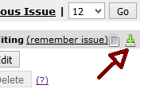
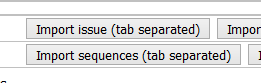

GCD utilities
=============

This is a little toolkit to help you with your `Grand Comics Database <https://www.comics.org>`_ offline indexing. If you don't know how offline indexing works, start by reading `the wiki <http://docs.comics.org/wiki/Indexing_Offline>`_.

This script allows you:

* to convert a TSV (tab-separated) index file downloaded from GCD into a human-readable TXT file;

* to make a new, empty TXT human-readable file ready to use as a grid  for your own offline indexes;

* to convert your TXT file(s) back into TSV files ready to be uploaded on GCD web interface.

The intended usage is quite simple: just drop this script in a directory with all your TSV and/or TXT files. You may specify alternative input/output directories if you prefer. You may also toy a little with the global variables of the script. Then, just double click the script and follow the interactive interface. 

Prerequisites.
--------------

You should have any of `Python <https://www.python.org/downloads/>`_ 2.7 or 3.3-3.6 installed. 

This script may also query a local dump of the GCD database and filling in missing values in your index file. This is an entirely optional feature: if you plan to take advantage of this capability, you must meet a few more requisites - see below for details. 

Also, do not try offline indexing without a good solid *unicode-aware* text editor - ie, do *not* use NotePad. We recommend `SublimeText <https://www.sublimetext.com/>`_ but any modern text editor will do. Make sure your editor is set up to open/save files with UTF-8 encoding (this should be by default in modern editors).

Convert downloaded TSV index files.
-----------------------------------

GCD allows you to download relevant data in a convenient TSV format. Just open any issue's view and press the download button:

Note: this toolkit works with TSV (tab-separated) format only. Do not download CSV (comma-separated) files.

This toolkit allows you to convert the downloaded TSV file into a human-readable format: just drop your TSV in the same directory of the `offindex.py` script, double-click the script and follow the instructions. The script will convert all the TSV files found in the input directory at once. 

Start a new offline index file. 
-------------------------------

To help you starting a new offline index file, this script will make a fresh, empty human-readable grid for you. Just double-click the script and follow the instructions. Rename the resulting `empty.txt` file as you like, open it with your text editor (be sure to set the editor encoding to utf-8) and you are ready to go. 

Besides the general offline indexing `instructions <http://docs.comics.org/wiki/Indexing_Offline>`_, you must follow a few simple rules:

* do not alter the "end-of-sequence" mark, always use it to end a sequence (of course), and be careful to end the file with a EOS mark followed by at least one empty new line;

* do not break lines inside a field: each field, its own line. (We know, you might want to break lines when writing a long note/synopsis. You can't. This will be fixed at some point);

* do not change the fixed 15-characters width separating the field name from its content.

There are also a few little tricks and shortcuts to speed up your work:

* the order of fields within a sequence does not matter;

* you can skip a field you don't need (there are convenient defaults for needed "SPICLE" fields): just delete the field line from your file. By writing only the relevant fields in each sequence, you keep your file more compact and readable;

* you may repeat the same field more than once in the same sequence: all values will be concatenated in the output. Also, "multi-line" fields are allowed: all same-indented lines below the first will be concatenated (open the example files to see how this works);

* comments (`//` marks) and blank lines are ok and will be ignored;

* you may put a `--SKIP` mark anywhere inside a sequence to prevent that sequence to be outputted. This is sometimes needed when you are indexing many similar issues from a common blueprint;

* you may use convenient abbreviations for genres and types: a few are already set, and you can add to your taste. 

Convert index file into TSV for uploading.
------------------------------------------

Once your index file is ready, the script will convert it back into TSV format ready to be imported in the GCD interface. Just put your file in the same directory of the script, double-click and follow the instructions. You will end up with two TSV files, one for the issue data, one for the sequences data.

You may upload the data files in the "edit issue" view: 

Please note that the script will convert all TXT files at once. Be careful not to have any spurious TXT file in the input directory.

The script checks for some obvious errors (wrong field names, wrong types/genres/dates...): if any error is found, you will receive a warning and a log file is generated. 

Change input/output directory.
------------------------------

Default input and output directory is just the one where you drop the script file. The script interface allows you to change that on a temporary basis; or, you can just edit the script to set new defaults. 

Editable settings in the script.
--------------------------------

At the top of the script you will find some editable settings. Most notably:

* `ISSUE_FIELDS` and `SEQUENCE_FIELDS` allow you to set, for each field, if it will be displayed in the empty grid, in what order, and (most important) a default value for the field;

* `ALLOWED_TYPES` and `ALLOWED_GENRES` allow you to set a short name for each type/genre;

* `OUTPUT_DIR` and `INPUT_DIR` allow you to set new default in/out directories.

Querying a local dump of CGD database.
--------------------------------------

This could be very useful when indexing lots of reprints: instead of copy-pasting each relevant field value, you can just fill in the id of the original story, and this script will query a local dump of GCD database for the missing values. 

For this to be enabled, you must meet some further requirements:

* you must have a local `MySQL<https://dev.mysql.com/downloads/>`_ server instance up and running on your machine;

* you must download a `GCD database dump<https://www.comics.org/download/>`_ and import it on your server (this should be as easy as opening a shell and typing something like ``/path/to/MySQLserver/bin/mysql -u root -p gcd < /path/to/dump_file.sql``, where "root" is the username and "gcd" the imported database name - be aware that on slower machines the command could take a *while* to be processed);

* you must install the `MySQLclient<https://github.com/PyMySQL/mysqlclient-python>`_ Python package. On Linux, this should be as easy as ``$ pip install mysqlclient``. On Windows, you may want to get the pre-compiled wheel packages from `Chris Gohlke's collection<http://www.lfd.uci.edu/~gohlke/pythonlibs/#mysqlclient>`_, then ``> pip install path/to/downloaded/wheel``. 

Once you are ready, set the ``USE_GCD_DUMP`` flag to ``True`` (it's ``False`` by default) to enable querying the database. Feel free to set the database connection parameters to your taste: if you leave them blank, you will be prompted at runtime. 

Also, you may want to adjust the ``TRANSLATIONS`` setting: this is a list of commonly-founded words in "SPICLE" fields (like "signed", "painted", etc.) to be translated in your language. You will find it useful if you're indexing foreign language reprints. However, you may disable translations by setting ``USE_TRANSLATIONS`` flag to ``False`` (it's ``True`` by default). 

To query the database dump for a field value, just put a ``DB_QUERY_MARK`` (it's ``>`` by default) at the start of your field, followed by the story id you want the value to be copied from. For instance::

    script         > 12345
    pencils        > 12345

will pick up "script" and "pencils" authors from the story id "12345".

Examples.
---------

Please check the `docs/examples` directory to find some examples of index files and generated outputs. 

TODO.
-----

* Check for required fields, check page count.

Known issues.
-------------

* Cross-version/platform unicode support in Python is hard. Depending on your operative system, locale and/or shell, the script might just crash on non-ASCII paths and file names, when launched by Python 2. But it should be ok on Python 3, and/or if you carefully rename your files to ASCII-only characters. Besides, non-ASCII filenames will only appear weird in the shell output - but generated file content will always be ok (ie, utf-8). 

* The script doesn't bother to check for already existing output file names, and will simply *append* the new content to the old. Which means, for example, that if by mistake you generate TSV output twice in a row, you will end up with a single TSV file containing twice the same sequences. So, be careful to clear output directory before launching the script. 

* You can't break lines inside a "descriptive" field (eg. notes, synopsis...). Unfortunately GCD import mechanism doesn't check for new-line marks, so you'll have to manually add your line breaks in the web interface. 

License and copyright.
----------------------

copyright 2017 - Riccardo Polignieri

license: FreeBSD

